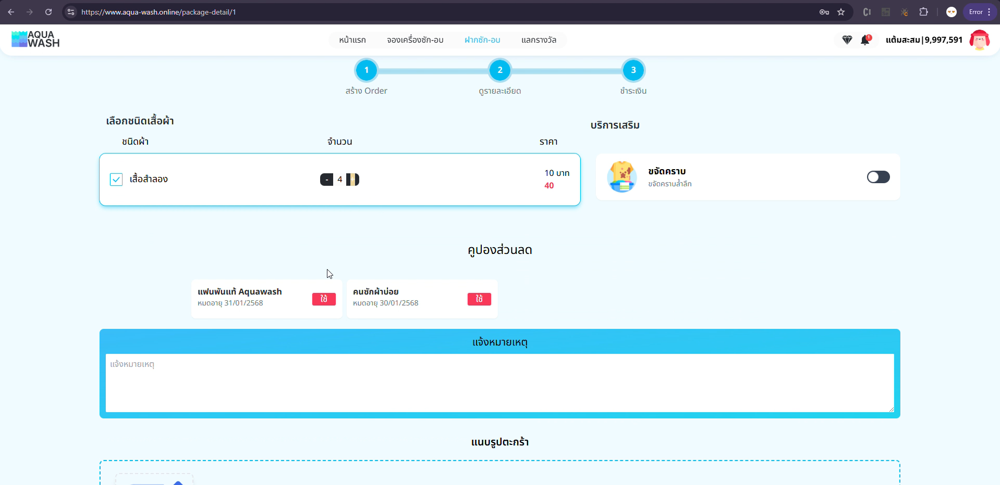
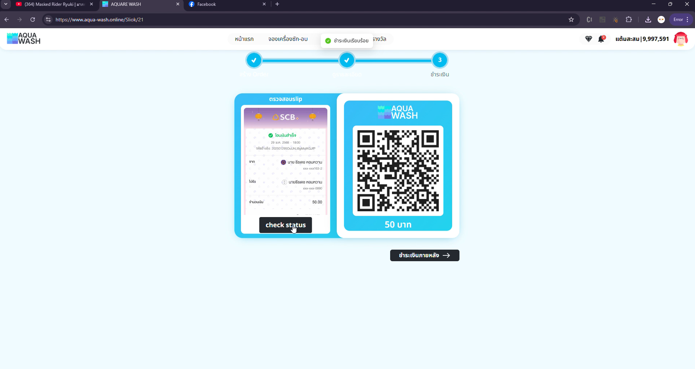
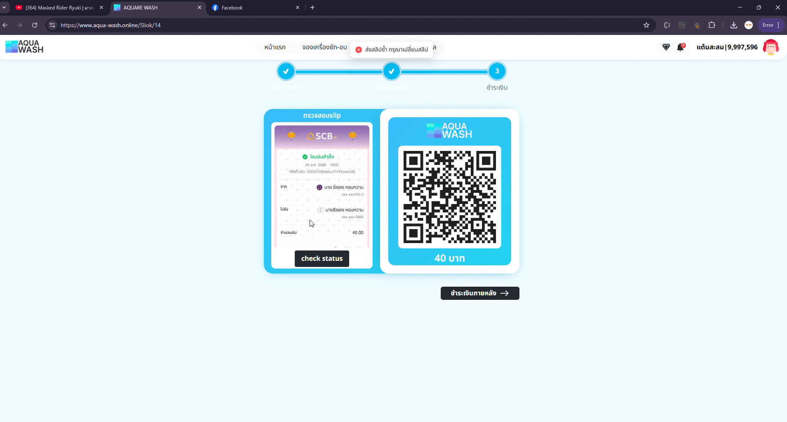
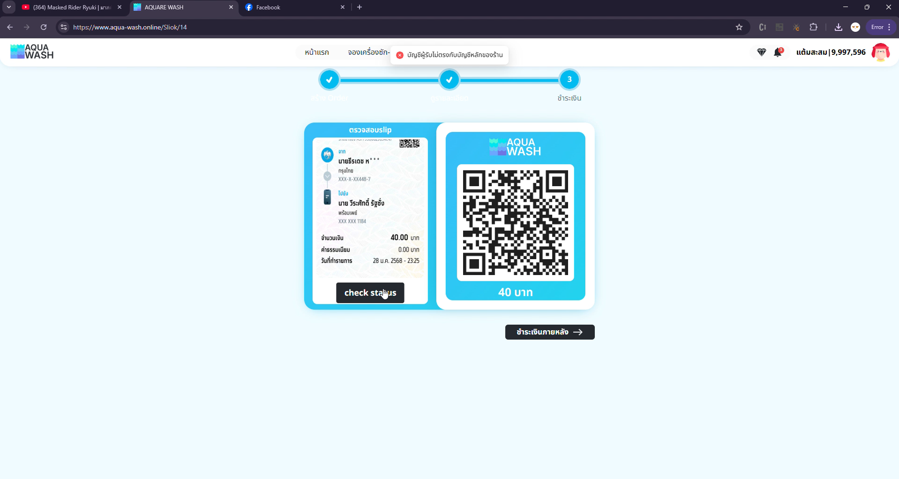
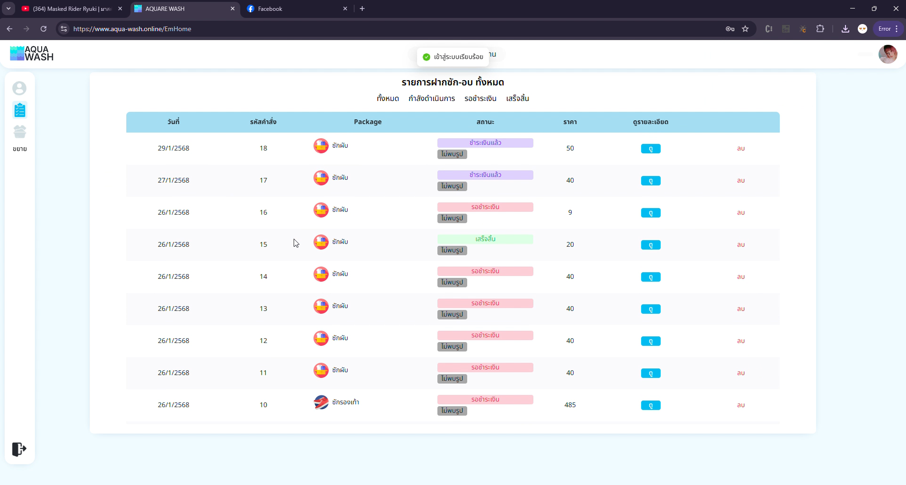
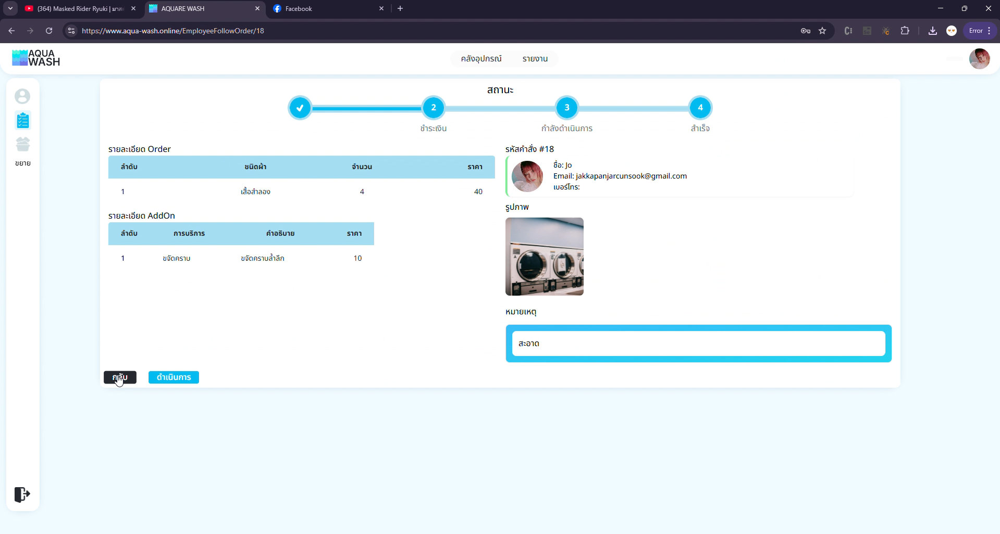
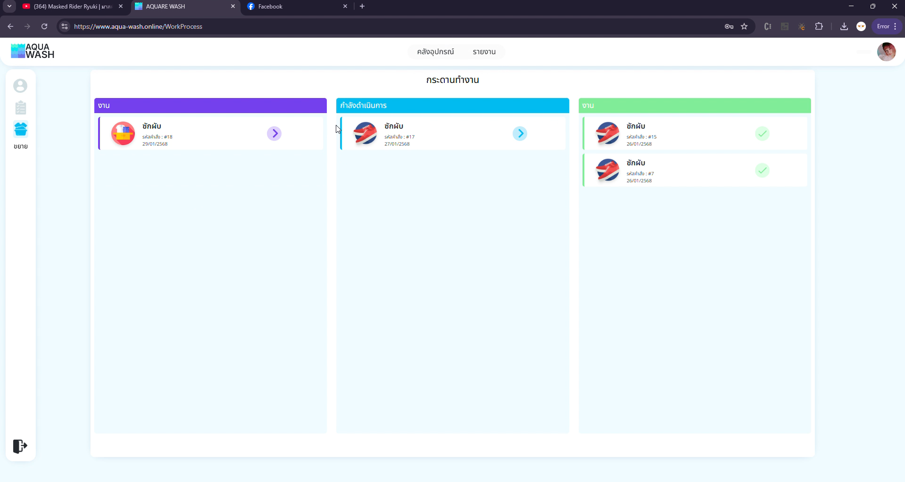

# 🧺 Aquare Wash – ระบบร้านสะดวกซัก

Aquare Wash คือระบบบริหารจัดการร้านสะดวกซักที่พัฒนาขึ้นเพื่อช่วยให้ลูกค้าสามารถฝากซักเสื้อผ้าได้อย่างสะดวก และให้ร้านสามารถจัดการคำสั่งซักและการชำระเงินได้อย่างมีประสิทธิภาพ

---

## 📌 ระบบที่รับผิดชอบ

### 1. ระบบสร้างรายการฝากซัก (Laundry Order System)

ลูกค้าสามารถสร้างรายการฝากซักโดยเลือกประเภทเสื้อผ้าและบริการที่ต้องการ ระบบจะทำการคำนวณราคาพร้อมจัดเก็บสถานะการดำเนินการของแต่ละคำสั่ง

**ฟีเจอร์:**
- เลือกประเภทบริการ (ซักผ้า, ซักรองเท้า ฯลฯ)
- ระบบคำนวณราคาตามรายการที่เลือก
- บันทึกข้อมูลคำสั่งซัก
- ติดตามสถานะการซักได้ เช่น: `ชำระเงิน`, `กำลังดำเนินการ`, `สำเร็จ`
- ฝั่งพนักงานสามารถดูรายละเอียดรายการฝากซัก และอัพเดทสถานะของรายการฝากซักได้
---

### 2. ระบบจ่ายเงิน (Payment System)

รองรับการชำระเงินหลายช่องทาง และสามารถบันทึก/แสดงสถานะการชำระของคำสั่งซักได้อย่างแม่นยำ

**ฟีเจอร์:**
- รองรับ:โอนเงิน / QR PromptPay
- แสดงยอดที่ต้องชำระแบบเรียลไทม์
- สามารถเช็คสลิปปลอม, ซ้ำ, โอนยอดไม่ตรง, และ บัญชีไม่ตรงกับทางร้านได้

---

## 🛠️ เทคโนโลยีที่ใช้

- **Backend:** Golang (Gin)
- **Frontend:** React Typescript
- **Database:** SQLite
- **Payment Integration:** Slip Ok api

---
## 📸 ตัวอย่างหน้าจอแอป

### 🔹 หน้าHome

### 🔹 หน้าสร้างรายการฝากซัก

### 🔹 หน้าชำระเงิน

### 🔹 เมื่อ ใช้ สลิปซ้ำ หรือ บัญชีไม่ตรง

### 🔹 ฝั่งพนักงาน สามารถดูรายการฝากซักได้

### 🔹 ฝั่งพนักงาน สามารถดูรายละเอียดภายในรายการฝากซักได้

### 🔹 ฝั่งพนักงาน สามารถอัพเดทสถานะของรายการฝากซักได้

## 🎬 วิดีโอตัวอย่างการใช้งาน

▶️ สามารถดูที่ folder ./vdo+image/demo-app - Made with Clipchamp.mp4

